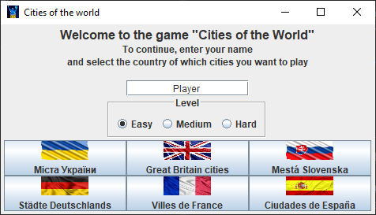
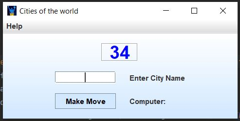
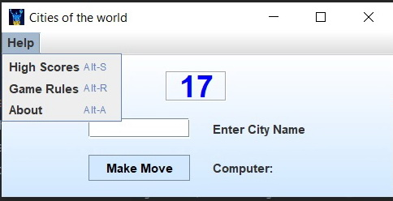

# Cities of the world
### Simple game for one human player.

---
On game launch, the player is prompted to enter
their name and choose a language.

The player must enter the name of a city. On the last
letter of the entered word, the computer searches
for and selects a word that starts a new word in
response.

Words repeating is not allowed. Points are kept track of, and
the data entered by the player is validated.

### Winning conditions:

* For the player: The computer runs out of words in its database to respond with.
* For the computer: When the human player enters "I give up" in the text field.

`Help`  menu, contains information about:
* game rules
* table of high scores
* about

Depending on the chosen language, the game loads a list of
corresponding cities from a pre-prepared text file. The `ResourceBundle`
class was used for interface localization.

The task was to create a simple graphical application with
independent study and utilization of the `java.swing` and `java.awt`
libraries.

Additionally, the ability to choose difficulty level was implemented,
which is determined by the time limit for player word input.

The game also saves the top 10 scores in a text file.

This program was developed as an independent project during the GOIT
Java Developer - 14 course, as a culmination of the Java Core
learning stage. It was created by a group of three students (group-7).
* Yurii Mezentsev [github](https://github.com/ymezentsev)
* Olha Senchyk [github](https://github.com/OlliSensible)
* Kostiantyn Oparnykov [github](https://github.com/KostiantynOparnykov)

ver 1.0  
the middle of 2023
